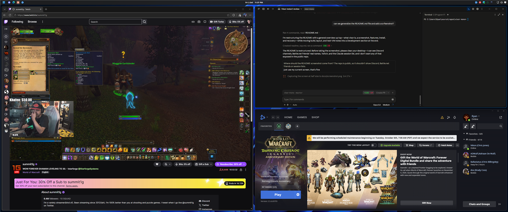

# visor

An [Omarchy](https://omarchy.org)-style desktop for Windows 11: tiling,
keyboard-driven and themeable, built the Windows way. Native C++ and Qt,
event-driven, small.



visor follows Windows 11's conventions wherever Windows has one (its themes,
accent colour, virtual desktops, Quick Settings, Win-key shortcuts) and
borrows from Omarchy and Hyprland only where Windows has nothing, such as
tiling and a status bar. It runs alongside Explorer, or replaces
`explorer.exe` as the Windows shell.

## Features

- **A status bar in QML** ([Visor](src/bar/README.md)), with live reload: the desktops, the clock, the tray, and the taskbar's own indicators: network, battery, volume, keyboard layout, the restart badge and the microphone, camera and location lights.
- **Tiling** ([`visor-wm`](#window-manager)): Hyprland's dwindle layout and key bindings, configured in a `hyprland.conf`-style file, with Windows 11's Snap behaviour where it fits.
- **Virtual desktops** that work like Windows 11's ([Desktops](#desktops)).
- **A launcher, a system menu and a key-binding cheat sheet** ([Launcher and menus](#launcher-and-menus)).
- **Windows themes**, followed and switched by Visor: wallpaper, dark/light mode, accent colour and the Windows Terminal scheme in one go, with six Omarchy-style themes included ([Themes](#themes)).
- **Without Explorer:** a desktop and wallpaper, the tray, toasts and a Notification Center, Quick Settings, the volume display, an Alt+Tab switcher with live previews, and the programs Windows starts at sign-in.

## Status

Every planned phase is done, and visor is the author's daily desktop in replace mode on a single 3440x1440 monitor. More than one monitor hasn't been tested yet. Replacing Explorer isn't something Windows supports on desktop editions, so some things need Explorer: UWP apps such as Settings and Calculator can't open in replace mode ([docs/phase0-compat.md](docs/phase0-compat.md) lists what works without Explorer). See [docs/design.md](docs/design.md) for the architecture and plan.

| Program | Source | What it is |
| --- | --- | --- |
| `visor.exe` | [`src/bar`](src/bar) | The status bar, launcher, menus and theme switcher, configured in QML (live reload). It draws all of the UI. It works on its own under Explorer; with visor-shell it also shows tasks and the tray. See [src/bar/README.md](src/bar/README.md) for config and the QML API. |
| `visor-session.exe` | [`src/session`](src/session) | What Windows starts at sign-in: as the shell in replace mode, from a Run entry in hosted mode. Plain Win32, static CRT, no Qt. Starts `visor-shell`, restarts it after a crash, and (as the shell) falls back to Explorer when it can't run. |
| `visor-shell.exe` | [`src/shell`](src/shell) | Shell services: desktop and wallpaper, the shell-ready signal, hotkeys, window (task) tracking, the notification area (`Shell_TrayWnd`), the app bar server, and starting and supervising Visor and visor-wm. Draws no UI of its own. Visor does that, over the link in [`src/common/linkprotocol.h`](src/common/linkprotocol.h). |
| `visor-wm.exe` | [`src/wm`](src/wm) | The tiling window manager, in Hyprland's role: tiles app windows with the dwindle layout inside the space Visor's bar leaves, as the shell or under Explorer. Configured by a `hyprland.conf`-style `wm.conf`. See [Window manager](#window-manager). |

## Installing

Build it first (see [Building](#building)); everything lands in `build/release/`. Copy that folder somewhere permanent, such as `%LOCALAPPDATA%\Programs\visor`, then pick a mode. Both are per-user and take effect at the next sign-in; `etc/uninstall.ps1` undoes either.

- **Hosted mode** (the Windows-conventional one): Explorer stays the shell and visor runs beside it, with the taskbar auto-hidden. Everything that lives in Explorer keeps working. Add `-Tiling` for the window manager. See [Hosted mode](#hosted-mode).

  ```powershell
  pwsh etc/install.ps1 -Path "$env:LOCALAPPDATA\Programs\visor\visor-session.exe" -Hosted -Tiling -AllowPhysicalMachine
  ```

- **Replace mode:** visor is the shell (the per-user Winlogon `Shell` value; the machine-wide one is never touched), with Explorer as the fallback.

  ```powershell
  pwsh etc/install.ps1 -Path "$env:LOCALAPPDATA\Programs\visor\visor-session.exe" -AllowPhysicalMachine
  ```

`install.ps1` refuses to run on a physical machine without `-AllowPhysicalMachine`: try it in a VM first (see [Test VM](#test-vm)), and know the way back below before you sign out. To try it without installing anything, `pwsh etc/build.ps1 -RunShell` runs hosted mode until you press Ctrl+Alt+Q.

### Emergency recovery

If sign-in lands on a black or broken desktop, try these in order:

1. **Wait.** If `visor-shell` crashes 3 times within a minute, `visor-session` starts Explorer.
2. **Press Ctrl+Alt+Q.** It quits to Explorer.
3. **Sign out and back in holding Shift.** That session starts Explorer instead. Sign out with Ctrl+Alt+Del.
4. **Use Task Manager.** Press Ctrl+Shift+Esc, choose **Run new task**, and enter `explorer.exe`. Enter `regedit` instead to edit the setting by hand.
5. **Use the safe-mode file.** Create `%LOCALAPPDATA%\visor-shell\safe-mode` and every sign-in starts Explorer until you delete it.
6. **Edit the registry by hand.** Delete the `Shell` value under `HKCU\Software\Microsoft\Windows NT\CurrentVersion\Winlogon`. The machine-wide `HKLM` value is never touched.
7. **In the test VM:** `pwsh etc/vm/deploy.ps1 -Restore` from the host removes the setting and starts Explorer, even when the VM's screen is black; or revert the VM to its `clean` checkpoint.

Logs are in `%LOCALAPPDATA%\visor-shell\logs\` (`session.log`, `shell.log`, `wm.log`, and `visor.log` when Visor isn't run from a terminal). Windows hidden on other desktops are listed in `%LOCALAPPDATA%\visor-shell\wm-hidden.txt` while `visor-wm` runs.

## Hosted mode

Explorer stays the Windows shell and `visor-shell --mode hosted` runs alongside it. This is the Windows-conventional configuration, and the one for a real machine: Windows has no supported way to replace Explorer on desktop editions (Shell Launcher is for Enterprise kiosks, and loses Store apps too), so everything that lives in Explorer keeps working here: Settings and Store apps, Windows' own toasts and Notification Center, Quick Settings, the volume flyout, Snap, Task View, Windows' Alt+Tab, Win+Shift+S and clipboard history. Replace mode stays the lighter path.

- **Starting at sign-in:** `etc/install.ps1 -Hosted` adds a Run entry (`HKCU\...\CurrentVersion\Run\visor-shell`) for `visor-session --mode hosted`, the way Windows starts any app at sign-in; it shows in Settings > Apps > Startup, where it can be turned off. `visor-session` is the same watchdog as in replace mode: it starts `visor-shell --mode hosted`, restarts it after a crash (the taskbar stays auto-hidden meanwhile, and the record of its original state is kept), and ends when the shell quits on purpose. Explorer is there already, so it never starts one. The entry and the replace-mode shell override are exclusive: each install removes the other, and `uninstall.ps1` removes both. In the VM, `pwsh etc/vm/deploy.ps1 -Hosted` does it all and starts the shell.
- **The taskbar:** visor-shell asks Explorer's taskbar to auto-hide, through the documented app bar API (`ABM_SETSTATE`; `Shell_TrayWnd` is left alone), so Visor's bar is the one on screen and the taskbar is a hover away at the bottom. Auto-hide is Explorer's own setting and persists, so the original is recorded in `HKCU\Software\visor-shell` the first time it is changed and put back on a clean exit: Ctrl+Alt+Q, the menu's **Quit Visor**, or `visor-shell --quit`. A crash leaves it for the next run to restore, and a restarted Explorer is asked again.
- **What visor-shell does here:** starts and supervises Visor and feeds it the task list, and starts and supervises visor-wm when tiling is on. Not the desktop, the tray (Explorer's auto-hidden taskbar has it, Visor's own icon included), app bars (Visor's bars register with Explorer's), or the startup programs.
- **Tiling** is off by default under Explorer and on with `install.ps1 -Hosted -Tiling` (`deploy.ps1 -Hosted -Tiling` in the VM): a `Tiling` value under `HKCU\Software\visor-shell`, where the shell keeps its other state; `-Hosted` without `-Tiling` turns it off again. With it on, visor-shell runs `visor-wm --mode hosted`, which tiles windows on the current Windows desktop and binds Omarchy's keys, but leaves Windows every key it acts on itself and its own virtual desktops: see [Keys](#keys) and [Desktops](#desktops). Without it, Explorer keeps every Win-key shortcut.
- **Keys:** the launcher and the menu open from the bar's button (left and right click); Win, Win+S, Win+X and Win+R stay Windows' whether tiling is on or not. Ctrl+Alt+Q quits visor-shell, Visor and visor-wm together.
- **What Visor leaves to Windows:** toasts and the Notification Center (no bell in the bar), the volume display and the Alt+Tab switcher. The theme picker's last row, **Personalization settings...**, opens Settings. All of it verified in the VM, with tiling on too: see [docs/phase0-compat.md](docs/phase0-compat.md#hosted-mode-explorer-stays-the-shell).
- **Not done:** tray icons stay on Explorer's taskbar; taking over `Shell_TrayWnd` by z-order so they come to the bar is a later option.

## At sign-in

Without Explorer, nothing would start the programs Windows runs at sign-in. In replace mode `visor-shell` does it, a few seconds after the desktop is up: RunOnce, the Run keys (machine and user, including the policy ones) and both Startup folders, honouring whatever Settings > Apps > Startup has turned off. It happens once per sign-in, so restarting the shell doesn't start everything twice. Signing out and shutting down work the normal way: the shell steps aside when Windows asks, and the watchdog doesn't restart it.

## Launcher and menus

These are QML in Visor ([`src/bar/config`](src/bar/config): `Launcher.qml`, `SystemMenu.qml`, `CheatSheet.qml`), opened by key bindings in `wm.conf` that visor-wm passes to Visor (`bindd = SUPER, S, Launcher, visor, launcher`), or from the button at the left of the bar, which shows Windows' Start logo.

| Keys | Action |
| --- | --- |
| Win (pressed alone), Win+S, or click the bar's button | The launcher |
| Win+X, or right-click the button | The system menu: the theme picker, then lock, sign out, sleep, restart, shut down, quit to Explorer |
| Super+K | The key-binding cheat sheet |
| Win+R | The Run dialog |
| Super+Ctrl+Shift+Space | The next theme (see [Themes](#themes)) |
| Win+N, or click the bell | The Notification Center (see [Notifications and on-screen display](#notifications-and-on-screen-display)) |
| Win+A, or click the network / volume cluster | Quick Settings (see [Quick Settings and indicators](#quick-settings-and-indicators)) |

- **Launcher:** the search box, then what's on the desktop as a grid of icons (where Start has its pinned apps; replace mode has no desktop icons otherwise, and tiled windows cover the desktop anyway), then every app Start would list (`shell:AppsFolder`: Start Menu shortcuts and packaged apps) A-Z. It's indexed in the background and refreshed when a Start Menu or Desktop folder, the desktop icon settings or a package changes. Type to search (fuzzy: `wt` finds Windows Terminal): All apps is filtered and scrolls, and the desktop stays above it as it is; arrow keys pick, Tab goes between the desktop and the list, Enter opens, Ctrl+Shift+Enter opens as administrator, Esc closes. If nothing matches, Enter runs what you typed as a command. Launches run on their own threads, so one that hangs blocks nothing.
- **Packaged apps in replace mode:** without Explorer, Windows can't start packaged apps through the shell ("class not registered"). Those that run as ordinary processes (Terminal, Store Notepad, Paint) are started through their execution alias or executable instead, found in their manifest. UWP apps (Settings, Calculator, Clock) couldn't show a window anyway; they're listed dimmed as "Needs Explorer", after everything else. Under Explorer everything launches normally.
- The bare Win press uses visor-wm's keyboard hook, so like the hooked keys below it doesn't work while an app running as administrator has focus; Win+S does. Win+Space is left alone: Windows uses it to switch keyboard layouts.
- Pop-ups open on the monitor of the focused window, under the bar (the cheat sheet in the middle), and close when focus goes elsewhere.

## Themes

Windows owns the look, and Visor follows it, the way the taskbar and every app do: the bar's colours come from Windows' dark/light mode and accent colour, and change the moment they do, whether through Settings, a `.theme` file or Visor itself. A theme is Windows' own kind, a `.theme` file (wallpaper, dark/light mode, accent colour), and switching one does what picking it in Settings > Personalization does, so apps, window frames and the wallpaper follow. In replace mode Settings can't run, so Visor has the switcher: **Themes** in the Win+X menu, or Super+Ctrl+Shift+Space for the next one. Under Explorer the picker also offers Settings itself.

The picker lists Windows' themes (`Windows (light)`, `Windows (dark)`, Flow, Glow, ...), the ones Settings saved for you (`%LOCALAPPDATA%\Microsoft\Windows\Themes`, where theme packs unpack too), and six that ship with Visor (`config/themes`): Tokyo Night, Catppuccin Mocha, Catppuccin Latte (light), Nord, Gruvbox and Everforest, all MIT palettes, each a `.theme` with a generated wallpaper (`etc/make-wallpapers.py`) and, Omarchy-style, a matching Windows Terminal scheme in `<name>.terminal.json` beside it. Windows has no convention for terminal palettes, so that part is the one addition: applying such a theme puts the scheme into Terminal's `settings.json` and makes it the default profiles' scheme (keeping the original once as `settings.json.before-visor`); Windows' own themes leave Terminal alone.

Of a `.theme`, Visor applies the wallpaper and its fit, `SystemMode` / `AppMode` and `ColorizationColor` (the registry values Settings writes, followed by the `ImmersiveColorSet` broadcast everything listens for), and records it as Windows' current theme. Sounds, cursors and desktop icons are left alone. A shipped theme names its wallpaper relative to itself, which Windows can't read, so applying one first installs an absolute-path copy in your Windows theme folder; from then on Settings shows and can re-apply it like any other. Drop your own `.theme` (and optional `.terminal.json`) in `%LOCALAPPDATA%\Microsoft\Windows\Themes` to add one. Windows Spotlight (the default theme on a fresh Windows 11) isn't listed: its daily pictures come from Explorer, and its theme file only names a small placeholder, so while it is the background in replace mode (by its theme, or by the placeholder being the wallpaper, as after a visit to Settings' Themes page) the desktop shows Windows' own wallpaper for the mode instead. Pick any other theme to change that. The whole switch runs from Visor, so it works the same under Explorer.

## Notifications and on-screen display

Windows shows toasts, keeps them in the Notification Center and puts a flyout on screen for the volume keys. All of that is Explorer's, so in replace mode Visor does it, the way Windows 11 does; under Explorer it stays out of the way.

- **Toasts** appear at the bottom right of the primary monitor, newest at the bottom, for five seconds (longer while the pointer is over one), then go to the history. The X, or a click, sends one there at once. What a click would do in the app isn't available to us, so that is all it does.
- **The Notification Center** is the bell at the right of the bar, with how many notifications came since you last looked, or Win+N (Windows' key): the history, newest first, with the app's icon and name. Up/Down and Delete, or the X, dismiss one; **Clear all** clears them. Both remove them from Windows too, so they don't come back.
- **Where they come from:** without Explorer, Windows still delivers every toast to its notification platform (which is how they reach the Notification Center normally); Visor reads them from there through the same listener API a notification-mirroring app would use. It's allowed by default. If Settings > Privacy & security > Notifications ever turns access off for Visor, the center says so.
- **The volume keys** change the volume in 2 % steps (a step unmutes, as in Windows) and show the display: a pill at the bottom centre of the monitor you're working on, with the level and the number, gone two seconds later. It never takes focus. Without Explorer, Windows itself does nothing with these keys; they're `wm.conf` bindings (`bindeld = , XF86AudioRaiseVolume, Volume up, visor, volume up`, Omarchy's names), so they need `visor-wm`.
- **Brightness** keys are handled by Windows itself even without Explorer, and on hardware that has brightness control (laptops) the display shows the new level when they're pressed. `visor brightness up` / `down` are there to bind to keys of your own. *Not tested yet: the VM has no brightness control.*
- **Do not disturb** is Windows' own setting (Settings > Notifications), toggled with the moon in the Notification Center's corner. While it is on the bell is a moon, as on Windows 11's taskbar, and toasts go straight to the history with no pop-up.

## Quick Settings and indicators

The bar's layout starts from Omarchy's: the launcher and desktops on the left, the clock and status indicators in the centre, the hardware cluster and notifications on the right. The open windows and the tray sit either side of the clock (windows to its left, tray to its right), growing outwards from it. What fills it is Windows': each indicator is one the taskbar has, and shows only when it has something to say.

- **The cluster** at the right is the taskbar's: network (Wi-Fi with its signal, Ethernet, cellular, or a crossed globe with no internet), the battery with its percentage (laptops only; a desktop has none, so nothing shows), and the volume (the speaker alone, without a percentage; it's in Quick Settings). A click, or Win+A (Windows' key), opens **Quick Settings** like Windows 11's: Wi-Fi and Bluetooth buttons for the radios the machine has (switching them through Windows' Radio API, so Settings and the buttons agree), battery saver as a status, the brightness slider where there is one, the volume slider with the output device's name, a line with the connection and the battery, and under Explorer an **All settings** row for the rest. Right-clicking the cluster mutes, scrolling changes the volume. Night light isn't there: Windows has no supported API for it.
- **The clock** in Windows' own time format, 12- or 24-hour as Settings > Time & language > Language & region says, as the taskbar writes it. A click opens Windows' Date and Time dialog (the taskbar's calendar flyout is Explorer's and isn't there in replace mode).
- **Keyboard layout**, next to the clock, only when more than one is installed, as Windows' input indicator: the language's code ("ENG"), following the window you're typing in. A click switches it, as Win+Space does.
- **Restart required**, next to the clock, when Windows Update has installed something and is waiting for a restart (the icon Explorer's taskbar shows). A click opens the menu, whose Restart row does it; under Explorer it opens Windows Update.
- **Microphone, camera and location** in use, left of the clock: Windows' privacy indicators, read from the same per-app access store Windows keeps for its own.

All of it is event-driven (network status events, power-setting notifications, radio state events, the shell hook for the layout, registry change notifications for the rest); nothing polls.

## Window manager

`visor-wm` tiles windows the way Hyprland does in Omarchy. visor-shell starts it and restarts it if it crashes: always in replace mode, and under Explorer when tiling is on (see [Hosted mode](#hosted-mode)). It can also be run by hand (`visor-wm.exe`; `--mode auto`, the default, sees whether Explorer is the shell). It has no window, so stop it from Task Manager; your windows stay where they are.

- **Dwindle layout:** each new window splits the focused one, side by side when the space is clearly wider than tall (`split_width_multiplier`, 0.75 by default, so on a 21:9 screen the third window goes under the second, not beside it), otherwise one above the other. Closing a window gives its space back.
- **What tiles:** normal resizable app windows. Dialogs, fixed-size, always-on-top and fullscreen windows float, and so do windows of elevated apps (such as Task Manager), because Windows won't let a normal app move them.
- **Maximise and minimise still work:** a maximised window keeps its tile and goes back into it when restored. A minimised window leaves the layout until it comes back.
- **Dragging** a tiled window snaps it back into its tile, or into the layout of the monitor it was dropped on.
- **Borders:** Windows' own. visor-wm doesn't colour window borders, so the focused window looks the way Windows draws it, including Settings > Personalization > Colors > "Show accent colour on title bars and window borders". Hyprland's `border_size` and `col.*` keys aren't supported.
- **Windows that won't shrink:** some apps have a minimum size (Windows Terminal stops at about 465 px wide, Discord at about 500 px tall). When a window ends up bigger than its tile, `visor-wm` remembers that size and moves the splits to make room, as Snap's divider stops at a snapped window's minimum: its neighbours get smaller instead of being covered, and resizing stops there too. Only when the screen can't hold every window's minimum does one cover part of its neighbour (kept on-screen, never off the edge).
- **Multiple monitors:** each monitor has its own layout. New windows tile on the monitor they open on. Gaps are logical pixels, so they scale with each monitor's DPI, as in Hyprland. Focus and swapping cross monitors. Where there's no window to swap with, Super+Shift+arrows moves the window to the monitor in that direction, like Win+Shift+Left/Right in Windows (floating windows too). Windows on a monitor that's unplugged move to the primary one. *This part hasn't been tested with more than one monitor yet.*

Config is `wm.conf`, a subset of `hyprland.conf`, and saving it applies it at once. It is looked up like Visor's config: `--config`, `%VISOR_WM_CONFIG%`, `~/.config/visor/wm.conf`, then [`src/bar/config/wm.conf`](src/bar/config/wm.conf) (debug builds), then `config/wm.conf` next to the exe. The default file documents every setting: gaps, the dwindle options, `source = <file>` includes and window rules such as `windowrule = float, exe:^notepad\.exe$`.

### Keys

The default bindings follow Omarchy, except Super+arrows: Omarchy moves focus with them, but in Windows Win+arrows move the window (Snap) and Alt+Tab changes focus, so they run Hyprland's `movewindow` (`movefocus` is still there to bind). They are all `bind` lines in `wm.conf`, in Hyprland's syntax (`bind = SUPER SHIFT, left, swapwindow, l`), so you can change them and save to apply.

| Keys | Action |
| --- | --- |
| Win, Super+S, Super+X, Super+K, Super+R | Launcher, system menu, cheat sheet, Run (see [Launcher and menus](#launcher-and-menus)) |
| Super+Ctrl+Shift+Space | Next theme (see [Themes](#themes)) |
| Volume keys | Volume up / down / mute, with the on-screen display |
| Win+N | Notification Center |
| Win+A | Quick Settings |
| Alt+Tab, Alt+Shift+Tab | The window switcher (see [Window switcher](#window-switcher)) |
| Super+Return | Terminal (`wt.exe`) |
| Super+E | File Explorer |
| Super+W | Close the window |
| Super+V | Float or tile the window |
| Super+F | Fullscreen, covering the bar |
| Super+Alt+F | Maximise, keeping the bar |
| Super+J | Switch the window's split between side by side and stacked |
| Super+arrows | Move the window: out of its tile and in beside the window that way. With none that way, a window beside a stack moves into its top (or bottom) row, as Win+Up makes a snapped half a quarter; otherwise to the monitor that way. A window in a row that moves down (or up) out of it first becomes a full-height column beside the rows, and goes into the next row on the next press (left/right likewise with columns) |
| Super+Shift+arrows | Swap the window with its neighbour |
| Super+minus / equal | Narrower / wider (add Shift for shorter / taller) |

Windows reserves some Win-key combinations even without Explorer (Win+arrows, Win+Shift+arrows, Win+Return, Win+=), so `visor-wm` catches those with a keyboard hook instead of a hotkey, as it does the bare Win press (`bindr = SUPER, SUPER_L, ...`: fires on release, if nothing else was pressed). One limit comes with that: they don't work while an app running as administrator has focus. Win+L always locks the screen.

**Under Explorer** (hosted mode with tiling on) Windows keeps every key it acts on itself, and `visor-wm` skips those bindings: the bare Win press (Start), Win+S, Win+X, Win+R, Win+N, Win+A, Alt+Tab and Alt+Shift+Tab, the volume keys (any binding with no modifier), and the desktop keys (Win+Ctrl+D, F4, Left, Right, and the two movetoworkspace rows, since the desktops are Windows' there). `wm.log` lists them as "left to Windows", and the cheat sheet leaves them out. The rest binds as usual: the tiling keys, Super+Return, Super+E, Super+K, the theme key. Two notes on that. Win+arrows and Win+Shift+arrows are Snap in Windows, but Snap would pull a window out of its tile, so with tiling on they move the window within the layout and swap it, as above (swapping with nothing to swap with moves the window to the next monitor, which is what Win+Shift+arrows do in Windows). And Super+W, V, F, K and E are Explorer's too (Widgets, clipboard history, Feedback Hub, Cast, Explorer); the keyboard hook takes them, so those Windows features lose their keys while `visor-wm` runs.

### Desktops

Windows 11's virtual desktops live in Explorer, so they're gone in replace mode. `visor-wm` provides its own, working the way Windows' do:

| Keys | Action |
| --- | --- |
| Win+Ctrl+D | New desktop (and go to it) |
| Win+Ctrl+Left / Right | Previous / next desktop |
| Win+Ctrl+F4 | Close the desktop; its windows move to the one on the left |
| Win+Ctrl+Shift+Left / Right | Move the window to the previous / next desktop, and go with it |

- Create as many as you like. They're named "Desktop 1", "Desktop 2"..., and each one covers every monitor.
- Visor's task list shows only the current desktop's windows, which is Windows' default.
- The bar shows them as numbered pills next to Start, even when there's only one (as Windows always keeps Task View on the taskbar). Click one to switch, or scroll over them.
- Windows has no key for moving a window to another desktop (it uses Task View), so the last row is our addition.
- Windows on other desktops are hidden. Desktops survive `visor-wm` restarting (after a crash, a redeploy, or visor-shell restarting): the next `visor-wm` picks up the desktops and their hidden windows. If the session goes back to Explorer (Ctrl+Alt+Q, or visor-shell not coming back), every window is shown first, so none is ever lost.
- **Under Explorer** Windows' own desktops are there (Win+Ctrl+D, Task View), so these are off and the bar shows no pills. `visor-wm` tiles each Windows desktop on its own: it asks Windows which desktop a window is on (`IVirtualDesktopManager`), keeps a layout per desktop, and follows a switch when the new desktop's windows appear, so a layout is as you left it when you come back. A window moved to another desktop in Task View joins the layout there.


### Window switcher

Windows 11 draws no Alt+Tab switcher without Explorer: the key still switches windows, blind. In replace mode `visor-wm` takes the key and Visor shows a switcher like Windows 11's: a panel in the middle of the monitor you're working on with a live preview of each window on this desktop, most recently used first. Alt+Tab steps forward and Alt+Shift+Tab back, the arrow keys move, and releasing Alt (or Enter, or a click) goes to the chosen window; Esc leaves things as they were. The previews are DWM's own, so they're live; a minimised window shows blank. Under Explorer, Windows' switcher is untouched.

## Shell hotkeys

visor-shell's own, which work even when visor-wm is down:

| Keys | Action |
| --- | --- |
| Ctrl+Alt+E | File Explorer (This PC) |
| Ctrl+Alt+T | Windows Terminal, or cmd if it won't start |
| Ctrl+Alt+R | Run dialog |
| Ctrl+Alt+Q | Quit to Explorer (in hosted mode: quit visor-shell, Visor and visor-wm; `visor-shell --quit` does the same from a script) |
| Ctrl+Shift+Esc | Task Manager (handled by Windows itself) |

## Development

### Building

Requirements: Visual Studio 2022+ with the C++ workload, CMake 3.21+, Ninja,
and Python 3 (used once, to fetch Qt).

```powershell
pwsh etc/bootstrap.ps1          # pinned Qt 6.10.3 into .deps/ (gitignored)
pwsh etc/build.ps1              # debug build of everything -> build/debug/
pwsh etc/build.ps1 release      # what etc/vm/deploy.ps1 ships to the VM
pwsh etc/build.ps1 -Run         # build, then run the bar
pwsh etc/build.ps1 -RunShell    # build, then run visor-shell alongside Explorer (hosted mode)
```

`etc/build.ps1` loads the MSVC environment for you. From a VS Developer prompt or
an IDE with CMake presets support you can use `cmake --preset debug` /
`cmake --build --preset debug` directly. All executables, the Qt runtime and the
bar's default config land in one folder, `build/<preset>/`.

### Layout

```
src/bar/        visor.exe: C++ sources, QML types, the default config and the shipped themes (src/bar/config)
src/shell/      visor-shell.exe
src/session/    visor-session.exe
src/wm/         visor-wm.exe (its default wm.conf ships in src/bar/config)
src/common/     Code shared by all of them (exit codes, logging, the shell <-> bar link)
etc/            Scripts: bootstrap, build, install/uninstall, icon and wallpaper generators
etc/vm/         Test VM scripts: create, deploy, screenshot, input
docs/           Design, plan, and the compatibility results
.deps/          Local Qt toolchain (created by etc/bootstrap.ps1, not committed)
```

### Test VM

All of these scripts run on the host. They need Hyper-V admin rights.

```powershell
pwsh etc/vm/new-vm.ps1 -Iso <win11.iso>   # create the VM, then install Windows 11 Pro
pwsh etc/vm/new-vm.ps1 -Checkpoint        # take the "clean" checkpoint
pwsh etc/vm/save-credential.ps1           # save the VM login (encrypted, outside the repo)
pwsh etc/vm/deploy.ps1 -Install           # copy the build and make it the VM user's shell (replace mode)
pwsh etc/vm/deploy.ps1 -Hosted            # copy the build, install hosted mode and start it (Explorer stays)
pwsh etc/vm/deploy.ps1 -Hosted -Tiling    # the same, with visor-wm (tiling) on
pwsh etc/vm/deploy.ps1                    # later deploys: copy everything to C:\visor and restart, either mode
pwsh etc/vm/deploy.ps1 -Restore           # back to plain Explorer
pwsh etc/vm/screenshot.ps1                # the VM's screen -> build/vm-screen.png
pwsh etc/vm/input.ps1 -Click 948,16 -Button right   # click inside the VM
pwsh etc/vm/input.ps1 -Key ctrl+alt+r     # press keys inside the VM
pwsh etc/vm/run.ps1 -Script '...'         # run PowerShell in the VM user's session, and get its output
pwsh etc/vm/screenshot.ps1 -Inside        # the screen as the signed-in user sees it (works in an Enhanced Session)
```

The VM has no sound hardware. For anything that needs an audio device (the volume keys), connect to it with vmconnect's **Enhanced Session** (View menu) with remote audio on: Windows in the VM then has a Remote Audio endpoint for as long as you're connected. While you are, the console shows the lock screen, so `screenshot.ps1` needs `-Inside`.

`screenshot.ps1` and `input.ps1` work through Hyper-V and PowerShell Direct, so they need no VM window or focus on the host. Note that Windows 11 opens console programs in Windows Terminal, which takes the foreground. The input helper runs under `conhost --headless` so it doesn't disturb what it is testing.
